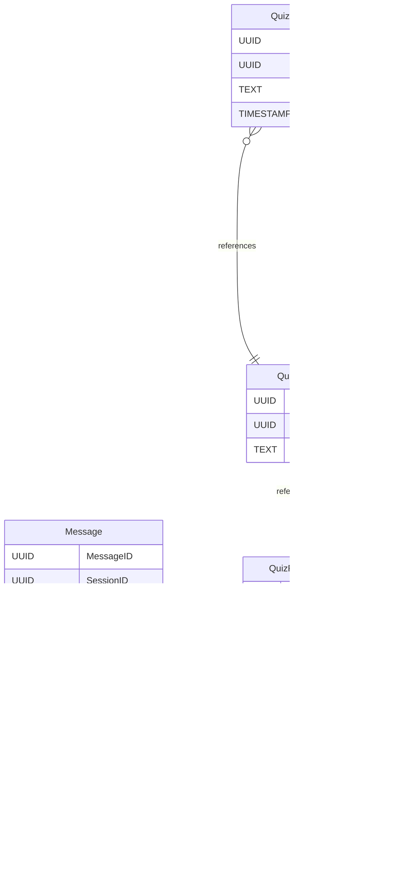

# Entity Esbot documentation
## Summary

- [Introduction](#introduction)
- [Database Type](#database-type)
- [Table Structure](#table-structure)
	- [Sessions](#sessions)
	- [Message](#message)
	- [QuizRequest](#quizrequest)
	- [QuizEvaluation](#quizevaluation)
	- [QuizItem](#quizitem)
	- [QuizAnswer](#quizanswer)
- [Relationships](#relationships)
- [Database Diagram](#database-diagram)

## Introduction

## Database type

- **Database system:** PostgreSQL
## Table structure

### Sessions

| Name        | Type          | Settings                      | References                    | Note                           |
|-------------|---------------|-------------------------------|-------------------------------|--------------------------------|
| **SessionID** | UUID | 🔑 PK, not null, unique |  | |
| **UserID** | UUID | not null |  | |
| **StartedAt** | TIMESTAMP | not null |  | |
| **LastAccessed** | TIMESTAMP | not null |  | | 

### Message

| Name        | Type          | Settings                      | References                    | Note                           |
|-------------|---------------|-------------------------------|-------------------------------|--------------------------------|
| **MessageID** | UUID | 🔑 PK, not null |  | |
| **SessionID** | UUID | not null | fk_Message_SessionID_UserSession | |
| **MessageContent** | TEXT | not null |  | |
| **TimeStamp** | TIMESTAMP | not null |  | |
| **Sender** | BOOLEAN | not null |  | |
| **MessageType** | VARCHAR(32) | not null |  | | 

### QuizRequest

| Name        | Type          | Settings                      | References                    | Note                           |
|-------------|---------------|-------------------------------|-------------------------------|--------------------------------|
| **QuizID** | UUID | 🔑 PK, not null, unique |  | |
| **SessionID** | UUID | not null | fk_Quiz_SessionID_Sessions | |
| **QuizRequest** | TEXT | not null |  | | 

### QuizEvaluation

| Name        | Type          | Settings                      | References                    | Note                           |
|-------------|---------------|-------------------------------|-------------------------------|--------------------------------|
| **EvaluationID** | UUID | 🔑 PK, not null, unique |  | |
| **QuizItemID** | UUID | not null | fk_QuizEvaluation_QuizItemID_QuizItem | |
| **AnswerID** | UUID | not null, unique |  | |
| **Evaluation** | TEXT | not null |  | | 

### QuizItem

| Name        | Type          | Settings                      | References                    | Note                           |
|-------------|---------------|-------------------------------|-------------------------------|--------------------------------|
| **QuizItemID** | UUID | 🔑 PK, not null, unique |  | |
| **QuizID** | UUID | not null | fk_QuizItem_QuizID_QuizRequest | |
| **Question** | TEXT | not null |  | | 

### QuizAnswer

| Name        | Type          | Settings                      | References                    | Note                           |
|-------------|---------------|-------------------------------|-------------------------------|--------------------------------|
| **QuizItemID** | UUID | not null | fk_QuizAnswer_QuizItemID_QuizItem | |
| **AnswerID** | UUID | 🔑 PK, not null, unique | fk_QuizAnswer_AnswerID_QuizEvaluation | |
| **Answer** | TEXT | not null |  | |
| **TimeStamp** | TIMESTAMP | not null |  | | 

## Relationships

- **Message to Sessions**: many_to_one
- **QuizItem to QuizRequest**: many_to_one
- **QuizRequest to Sessions**: many_to_one
- **QuizAnswer to QuizItem**: many_to_one
- **QuizEvaluation to QuizItem**: many_to_one
- **QuizAnswer to QuizEvaluation**: one_to_one

## Database Diagram

