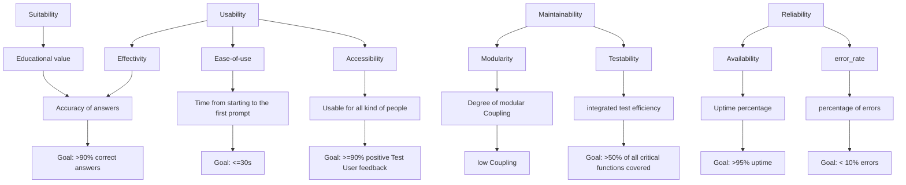

## Quality Model

### Suitability
Suitability describes the degree to which a user can achieve his goals with a system.  
For the ESBot the goal is to provide a learning assistant.
This means the ESBot has to provide relevant and correct answers and explanations for questions provided.

**Test Method:** Let experts review the correctness and quality of generated answers for a set of questions. 

### Usability
Usability describes the ability for users to achieve their goals and satisfy their needs with a product in an effective and efficient way.  
For the ESBot application the focus lies on the ease of learning.
It should provide an intuitive UI to make Users able to reach their goals without any onboarding.

**Test Method:** Take the time it takes for an with the system unfamiliar person to get his first explenation or exercise. 

### Maintainability
Maintainability describes the capability of a systems functionalities to be extended or fixed without breaking other parts.
Due to the ESBot beeing a educational project for software testing maintainability is needed to make the system testable.
Additionaly the AI-integration shall be exchangable for a mock. 

**Test Method:** Review code and dependencies.

### Reliability
Reliability describess the degree to which a system performs as intended. 
For the ESBot, reliability is important so it stays operational under normal use conditions with as few errors as possible.

**Test Method:** Fault injection and monitoring.