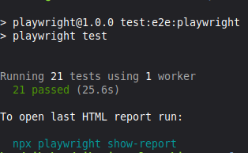
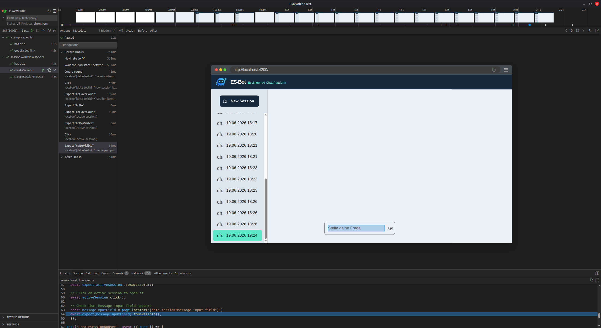

# E2E Test Report

## 1. Test execution summary
| Test Count | Number of tests passed | Number of tests failed | total runtime | framework | framework version |
|:----------:|:----------------------:|:----------------------:|:-------------:|:---------:|:-----------------:|
| 21         | 21                     | 0                      | 25.6s         | playwright| 1.0.0             |

## 2. Headless output


## 3. Interactive run


## 4. Flakiness observations
In the first runs of our tests, flakiness in our tests were observed. The cause was a timing error in displaying our sessions in the frontend. This has been fixed by adding the following code to the testfile.
```typescript
await page.waitForLoadState('networkidle'); // wait for sessions to actually load
```

## 5. Reflection
The order of steps that are needed to execute the tests was straightforward. The implementation of the tests itself was harder because the experience in frontend development and typescript / javascript was wide-ranging. Difficulties with timing errors in our first iteration of our tests made them flaky which was unexpected at first. Another problem was also changing our hardcoded userID to a non existent one. With more users this could have been even more difficult. Unit tests where a lot easier to implement and less complex. While API tests where about as complex as the E2E tests they were easier to integrate and timing errors were not an issue.
Our E2E tests can also be detected in some integration tests, for example trying to retrieve sessions without a user in the database. This is because in our BDD tests in the backend those scenarios are also covered. Our Unit tests as they have been developed early and have not been expanded to our services could also have caught that error. But because they are not implemented at this state, they could not have catched the error.
Our tests which cover the sessions don't have ai interaction, therefore they can be implemented even with a real LLM. Our message test would most likely fail, because the LLM output in non-deterministic. Therefore the message-content cant be verified or asserted. Verfication must be done by verifying the message is not null or (if the LLM allows it) character restricted and be verified or asserted for that.